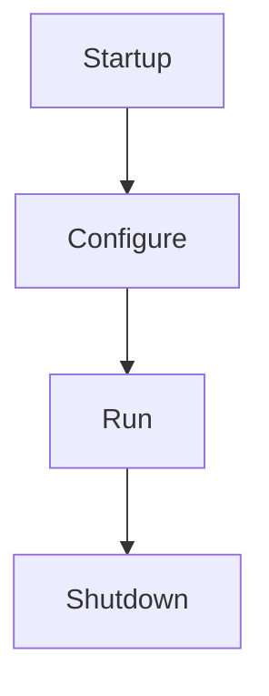

## Current Flow

```mermaid
flowchart TD
    A[Startup] --> B[Configure]
    B --> C[Run]
    C --> D[Shutdown]
```

## Fixed Flow
Documentation updated; runtime flow unchanged.

```mermaid
flowchart TD
    A[Startup] --> B[Configure]
    B --> C[Run]
    C --> D[Shutdown]
```
